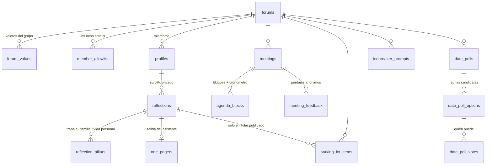

# Esquema de base y políticas de RLS — Foro EO

Este documento es lo que hay para revisar antes de escribir una línea de UI.
Todo lo que está acá está implementado en `supabase/migrations/` y **verificado
corriendo contra un Postgres 16 real** con `./scripts/db-test.sh`.

---

## 1. Mapa

## 2. Tablas, una por una

| Tabla | Para qué | Quién la ve |
|---|---|---|
| `forums` | Un foro. Propósito y fecha del próximo retreat. | Miembros del foro; edita el moderador |
| `forum_values` | Valores del foro, ordenables. | Miembros; **edita el grupo entero** |
| `member_allowlist` | Lista blanca de emails. Única puerta de entrada. | Solo el moderador |
| `profiles` | Miembro: nombre, foto, rol, fecha de ingreso. | Todos los del foro |
| `meetings` | Reunión: fecha, lugar, estado. | Miembros; edita el moderador |
| `agenda_blocks` | Bloques de agenda + estado del cronómetro. | Miembros; edita y corre el moderador |
| `reflections` | El 5% del mes. | **Solo su autor** |
| `reflection_pillars` | Trabajo / Familia / Vida personal × (emociones, causa, significado). | **Solo su autor** |
| `one_pagers` | Salida del asistente para ese 5%. | **Solo su autor** |
| `parking_lot_items` | Titular publicado, tipo, cuadrante, peso. | Todo el foro |
| `icebreaker_prompts` / `icebreaker_draws` | Catálogo y sorteos sin repetición. | Todo el foro |
| `date_polls` / `date_poll_options` / `date_poll_votes` | Votación de fecha de reunión y de retreat. | Todo el foro; abre y cierra el moderador |
| `meeting_feedback` | Puntaje 1–10, "qué la habría hecho un punto mejor", y los tres vértices del triángulo. | Lo cargado desde el celular: **solo su autor** + promedios. Lo dicho en la sala: todo el foro |

### Decisiones que vale la pena mirar

- **Los tres pilares son filas, no nueve columnas.** `reflection_pillars` tiene una
  fila por pilar. Agregar o renombrar un pilar más adelante no es una migración
  destructiva, y el histórico sigue leyéndose.
- **`emotions` es `text[]`.** El tope de 5 es una restricción de la tabla; el piso
  de 3 se exige recién al finalizar (`finalize_reflection`), para no pelearse con
  el guardado automático mientras la persona escribe.
- **El cronómetro vive en el servidor.** `timer_started_at` + `timer_elapsed_seconds`,
  y el tiempo se mide con `clock_timestamp()`. Si la tablet se recarga o se
  bloquea la pantalla, no se pierde nada y todos ven lo mismo. El transcurrido
  puede pasarse de la duración planificada: ese excedente es la señal.
- **El triángulo de valor y el puntaje son una sola tabla.** Ambos se responden en
  el mismo momento (cierre) y la restricción "una respuesta por persona por
  reunión" queda garantizada por la base. El objetivo de "menos de dos minutos"
  es un solo formulario.
- **Dos formas de cargar el cierre, porque el foro usa las dos.** `source = 'room'`
  es la ronda en voz alta que anota quien modera: ya se dijo delante de todos, así
  que se guarda con nombre y la lee el foro entero. `source = 'self'` es cada uno
  desde su celular: ese puntaje es anónimo y solo lo ve su autor. Una fila por
  persona por reunión, y **el origen no se puede cambiar después**: convertir un
  `self` en `room` publicaría algo que se cargó en privado. Si alguien ya cargó
  el suyo desde el celular, quien toma nota no puede pisarlo.
- **`meeting_feedback_responded`** dice *quién* respondió, nunca *qué* puso. Es lo
  que necesita quien toma nota para saber a quién le falta.
- **`meeting_feedback_summary` es una vista con `security_invoker = false`.** Corre
  con permisos del dueño, saltea la RLS de la tabla base y por eso **no expone
  `member_id`**: solo promedios y cantidad de respuestas. El filtro por membresía
  es la barrera entre foros.
- **La disponibilidad de fechas no es anónima** (coordinar requiere saber quién
  puede). Lo anónimo son los puntajes.

## 3. Roles y permisos

`forum_role`: `member` · `moderator` · `moderator_elect` · `moderator_outgoing`.

`moderator_outgoing` existe para que Esteban aparezca como moderador saliente en
la UI y en el histórico; **a nivel permisos es igual que `member`**.

| | Miembro | Moderador | Moderador electo |
|---|---|---|---|
| Cargar su 5%, generar su one-pager | ✅ | ✅ | ✅ |
| Publicar un titular al Parking Lot | ✅ | ✅ | ✅ |
| Proponer y votar fechas | ✅ | ✅ | ✅ |
| Puntuar reunión y triángulo | ✅ | ✅ | ✅ |
| Editar valores del foro | ✅ | ✅ | ✅ |
| Editar agenda y correr el cronómetro | — | ✅ | — |
| Abrir y cerrar votaciones, fijar retreat | — | ✅ | — |
| Ordenar el Parking Lot y agendar Deep Dives | — | ✅ | ✅ |
| Ver o editar la lista blanca, cambiar roles | — | ✅ | — |
| **Leer el 5% de otro** | ❌ | ❌ | ❌ |

## 4. Cómo se hacen cumplir las reglas de metodología

| Regla | Dónde vive |
|---|---|
| Solo entran los ocho | `member_allowlist` + trigger `on_auth_user_created`: sin fila en la lista, el alta **falla en la base**. No depende de la UI. |
| El 5% es privado | RLS `for all using (author_id = auth.uid())` en `reflections`, `reflection_pillars` y `one_pagers`. No hay policy de excepción para el moderador. |
| Lo único que se publica es el titular | `publish_parking_lot_topic()` **copia** el texto del titular a una tabla aparte. El cuerpo del 5% no se referencia ni se expone. Borrar el 5% no borra el titular ya publicado. |
| El curador ordena pero no reescribe | Trigger `parking_lot_curator_guard`: quien no es el autor solo puede tocar `position`, `status` y `scheduled_meeting_id`. |
| EQ y IQ no se mezclan | Tipos separados (`agenda_block_kind`, `topic_kind`) y cuadrante (`quadrant`) en todas las tablas donde aparece un tema. |
| Puntajes anónimos | Lo cargado desde el celular: cada uno lee solo su fila y el foro lee promedios; los comentarios salen **sin autor**. Lo dicho en voz alta en la sala se guarda con nombre, porque ya es público. |
| Sin exportación masiva ni links públicos | El rol `anon` no tiene ni un permiso (migración 0010). El bucket de fotos es privado (signed URLs). No hay endpoint de export ni de compartir. |
| Sin logs con contenido del 5% | `one_pagers` guarda la salida, no el prompt ni la respuesta cruda. |

## 5. Qué se probó

`./scripts/db-test.sh` levanta un Postgres efímero, aplica las diez migraciones y
el seed, y corre 15 chequeos. Todos pasan hoy:

1. `anon` no puede consultar nada.
2. Un email fuera de la lista blanca **no puede crear cuenta**.
3. Dos miembros cargan su 5%.
4. El 5% ajeno es invisible, **también para el moderador y la moderadora electa**,
   incluso buscando el texto con una query directa.
5. Nadie puede editar, borrar ni crear un 5% a nombre de otro.
6. Finalizar exige 3 a 5 emociones, causa y significado en los tres pilares.
7. Publicar al Parking Lot copia el titular y **nada más**; el foro entero lo ve.
8. La moderadora electa ordena y agenda, pero no reescribe el titular ni el peso ajeno.
9. La agenda base carga 8 bloques que suman **240 minutos exactos** (3 EQ, 1 IQ,
   2 breaks, 2 rituales); un miembro no puede editarla ni arrancar el cronómetro;
   el moderador sí, y el tiempo se acumula del lado del servidor.
10. La votación no cierra con menos de 5 fechas, no la cierra un miembro, y al
    cerrarla gana la fecha con más disponibles y nace la reunión con su agenda.
11. Un miembro no puede anotar el puntaje de otro; quien modera sí anota la ronda
    en voz alta y esas filas las lee el foro con nombre; los puntajes cargados
    desde el celular siguen siendo invisibles para el resto y sus comentarios
    salen sin autor; anotar en la sala no puede pisar lo que alguien ya cargó.
12. El icebreaker recorre todo el catálogo sin repetir y recién ahí empieza otra vuelta.
13. Cada uno sube su foto solo a su carpeta; el foro las ve.
14. Nadie se autoasciende de rol; el nombre propio sí se edita.
15. Un foro vecino no ve absolutamente nada del otro.

**Lo que no se probó todavía:** el comportamiento real de Supabase Auth (magic
link, `shouldCreateUser: false`), Storage con archivos de verdad, y la
concurrencia del cronómetro con varios clientes. El shim de `supabase/tests/`
reproduce `auth.users`, `auth.uid()` y `storage.objects`, no el servicio entero.
